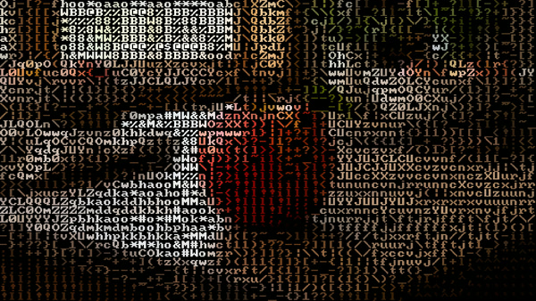
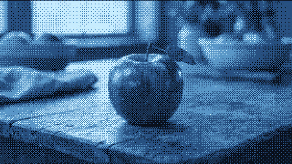
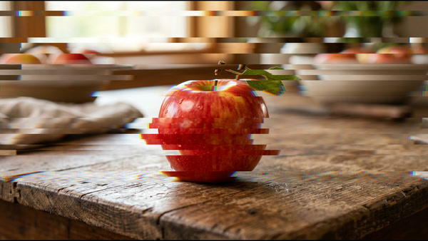
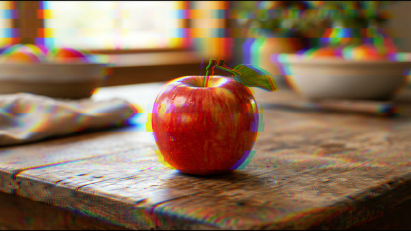
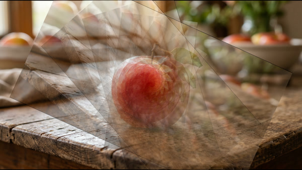
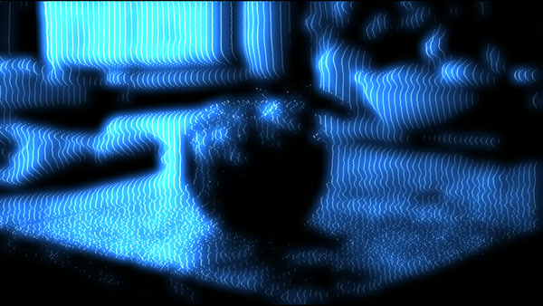

# purzOS OFX plugins

A collection of **64** native **OpenFX** video plugins for DaVinci Resolve,
Natron, and any other OFX host — retro/analog looks, pixelart, glitch, datamosh,
CRT/VHS
signal artifacts, colour grades and optical warps. Each plugin is a single
self-contained `.cpp` (sharing one small helper header, `common/purzfx.hpp`,
for the deterministic maths) compiled against the official OpenFX C++ Support
library. Several are ports of the [purzOS](https://github.com/purzbeats/purzOS)
web effects; the rest are OFX-native. Everything lands under **OpenFX → purzOS**.

All effects are **deterministic** — any randomness is hashed from
`(seed, frame, position)`, never `rand()` — so a render is byte-for-byte
identical on any machine and safe to distribute across a render farm.

## Install

Download the archive for your platform from the [**Releases**](../../releases)
page — `purzos-ofx-windows-x64.zip`, `purzos-ofx-macos-arm64.zip`, or
`purzos-ofx-linux-x64.zip` — unzip it, and drop the `*.ofx.bundle` folders into
your OFX plugins folder:

| OS | Folder |
|---|---|
| Windows | `C:\Program Files\Common Files\OFX\Plugins` |
| macOS | `/Library/OFX/Plugins` |
| Linux | `/usr/OFX/Plugins` |

Relaunch your host; the plugins show up under **OpenFX → purzOS** (in Natron,
under the **purzOS** group in the node/effects list). To install without admin
rights, put the bundles anywhere and add that folder to the `OFX_PLUGIN_PATH`
environment variable instead (`;`-separated on Windows, `:`-separated
elsewhere) — Resolve, Natron, and other OFX hosts all read it at launch.

Tested in DaVinci Resolve and Natron; should work in any OFX 1.x host.

- macOS builds are **arm64 (Apple Silicon)** only, and unsigned — clear
  quarantine after copying: `xattr -dr com.apple.quarantine /Library/OFX/Plugins`

## Effects

Every preview below applies the plugin to the same source frame:


### Ports of the purzOS web tools

| Preview | Plugin | What it does |
|---|---|---|
|  | ASCII | image rendered as ASCII cells (embedded public-domain 8x8 font) |
|  | Bayer Dither | ordered Bayer-matrix dithering |
|  | Pixel Sort | threshold-driven pixel sorting |

### Glitch (OFX-native)

`Hold frames` sets how many frames each glitch state lasts before re-rolling.

| Preview | Plugin | What it does |
|---|---|---|
|  | Slice Glitch | horizontal slice bands torn sideways (wrapping) with per-slice R/B split |
|  | Chroma Shift | directional RGB separation, jittering per horizontal band |

### Analog suite — one stage of an '80s composite/VHS signal path each

Real scanline signal processing in YIQ, driven by sines of (row, column, frame).
Stack them in signal-path order for the full effect: **Chroma Bleed → Luma Ring
→ Rainbow Phase → Tape Wow → Sync Drift**.

| Preview | Plugin | Signal stage |
|---|---|---|
|  | Chroma Bleed | tape chroma: delay-line offset + bandwidth crush + trailing colour smear (luma stays sharp) |
|  | Luma Ring | luma channel: band-limit softness, "detail knob" ringing halos, RF multipath ghost echo |
|  | Rainbow Phase | subcarrier: per-line hue drift that crawls, cross-colour rainbows on fine detail, dot crawl on chroma edges |
|  | Tape Wow | transport: slow wow + scanline flutter + frame bounce + bottom head-switch skew band |
|  | Sync Drift | the TV: h-hold diagonal shear, top-of-frame flagging, vertical roll with blanking bar |

### Looks & weird optics

Tone, glow, and self-sampling effects — deterministic, content-driven, no
randomness at all.

| Preview | Plugin | What it does |
|---|---|---|
|  | Halation | film-emulsion glow: thresholded highlights bloom back over the frame through a tint (film red, phosphor, amber…) |
|  | Duotone | luma through a two-ink ramp; presets (Cyanotype, Sepia, Midnight, Miami, Toxic, Heat, Gold Press, Chrome) + custom inks |
|  | Video Feedback | camera-at-its-own-monitor: nested zoomed/rotated copies with decay; Spin corkscrews the stack over time |
|  | Scan Warp | Rutt/Etra scan processor: the image's own brightness deflects the raster vertically — footage becomes terrain |
|  | Phosphor Melt | bright pixels burn in and drip decaying colour trails (down/up/left/right), like smeared phosphor burn |
|  | Vector Rescan | oscillographics: sparse scanlines ride the luma like terrain, drawn as a dotted beam with two-tier phosphor glow |

### Pixelart & dithering

Chunky, palette-locked, print-shop looks. All deterministic.

| Plugin | What it does |
|---|---|
| Posterize | per-channel bit-depth crush + optional snap to a vintage hardware palette (CGA / EGA / NES / PICO-8 / C64 / Game Boy), with ordered dither |
| Error Diffuse | Floyd–Steinberg error-diffusion dithering down to a small fixed palette, at a chunky pixel size |
| Mosaic | block pixelation with square / circle / diamond cells |
| Halftone | rotated dot screens — newsprint mono or a CMY colour rosette (port of the web tool) |
| Crosshatch | pen-and-ink crosshatch shading built up in layers as the image darkens |
| Threshold | 1-bit black/white cut with a hard, Bayer, or noise dither and custom ink/paper |
| Glyph Blocks | PETSCII-style 2×2 block-element mosaic on a terminal colour scheme |

### Glitch & datamosh

`Hold` sets how many frames each glitch state lasts before re-rolling; `Seed`
re-rolls the whole pattern. All hashed from `(seed, frame, position)`.

| Plugin | What it does |
|---|---|
| Block Mosh | fake datamosh — blocks yanked to hashed offsets and smeared, decaying over the hold |
| Bit Crush | bit-plane quantise per channel + probabilistic XOR corruption |
| Bad Signal | tape dropout dashes, static bursts, and whole scanlines collapsing to snow |
| Line Stutter | horizontal bands repeat / hold / shear sideways |
| Channel Delay | R/G/B pulled apart spatially along a direction, with time jitter |
| Wave Shear | sine-driven horizontal / vertical / both-axis shear ripple |
| Data Bend | per-row byte-rotation + random channel-order corruption |
| Ghost | RF multipath — decaying, tinted echo copies trailing the image |

### CRT & display

Tube simulation, from a single scanline pass to the whole curved screen.

| Plugin | What it does |
|---|---|
| Scanlines | CRT scanline darkening + optional RGB phosphor-triad stripes |
| Shadow Mask | phosphor mask — aperture grille, slot mask, or dot triad |
| CRT Screen | all-in-one tube: barrel curvature + scanlines + mask + vignette + rounded cutoff |
| Bloom | thresholded highlight bloom with a fast separable blur and a tint |
| Interlace | interlaced-field combing, odd field shifted and darkened (alternates per frame) |
| Roll Bar | a hum bar of brightness rolling vertically up the frame |
| Vignette | corner darkening + edge tint + film grain |
| Overscan | slight zoom into a rounded CRT bezel mask |

### Colour & tone

Per-pixel grades and false-colour maps — deterministic, no neighbours.

| Plugin | What it does |
|---|---|
| Solarize | Sabattier partial inversion above a threshold, per-channel or by luma |
| Thermal | false-colour thermal camera (Iron / Rainbow / Predator / Arctic) |
| Gradient Map | luma through a 3-stop gradient — Vaporwave / Sunset / Matrix / Ice / Fire / Mono / custom |
| Night Vision | image-intensifier green gain + grain + scanline + vignette |
| Chromatic | VHS colour — saturation boost, hue rotate, chroma quantise |
| Bleach | bleach-bypass: desaturate then overlay the luma back for crushed contrast |
| Infrared | Aerochrome false-colour IR — foliage to magenta, skies to cyan |
| Cross Process | film cross-process curves (C41-in-E6, E6-in-C41, Faded, Teal-Orange) |

### Analog signal extras

More one-stage composite/VHS failures to stack with the analog suite above.

| Plugin | What it does |
|---|---|
| Head Switch | the torn, noisy head-switching band across the bottom of a VHS frame |
| Dot Crawl | crawling composite dot-crawl shimmer along chroma edges |
| Hum | AC hum bars — rolling brightness ripple with a little horizontal push |
| Snow | analog TV snow / static, optionally only in the shadows |
| Tracking Bar | a band of tracking noise drifting vertically, lines torn and desaturated |
| Color Under | VHS chroma noise / rainbow speckle pooling in the shadows |
| Edge Enhance | VHS oversharpening — ringing halos around every edge |
| Dropout | white/black tape-dropout dashes riding the scanlines |

### Optics & warp

Lens and mirror geometry. `Spin` / `Speed` params animate over a clip.

| Plugin | What it does |
|---|---|
| Twirl | swirl the raster around the centre, hard in the middle, still at the edge |
| Fisheye | barrel / pincushion lens distortion with zoom |
| Kaleidoscope | mirror-wedge radial symmetry |
| Bulge | localised pinch / punch lens at a movable centre |
| Mirror Tile | seamless mirrored tiling (X / Y / quad / both) |
| Chromatic Aberration | radial RGB lens fringing, strongest at the edges |
| Ripple | radial pond ripple, animated and falling off with distance |
| Melt | per-column downward drip, like the picture sliding off the screen |
| Glass | frosted-glass value-noise refraction wobble |

## Build from source

Prerequisites: **CMake 3.16+**, **Visual Studio (MSVC x64)**, and the OpenFX SDK
cloned into `openfx/` (it is git-ignored — this repo does not redistribute it):

```sh
git clone https://github.com/AcademySoftwareFoundation/openfx openfx
```

Then:

```powershell
.\build.ps1            # configure (first run) + build Release → build\bundles\<Name>.ofx.bundle
.\build.ps1 -Install   # also append build\bundles to the user OFX_PLUGIN_PATH
```

`-Install` appends to the `OFX_PLUGIN_PATH` user environment variable (never
overwriting), so no admin rights are needed. Relaunch Resolve afterward.

## License

Plugin source is **MIT** (see [LICENSE](LICENSE)). The OpenFX SDK it builds
against is BSD-3-Clause and **not included here** — it's cloned from upstream at
build time. Binary releases statically link the OpenFX Support library and ship
the required attribution in [THIRD-PARTY.md](THIRD-PARTY.md).
